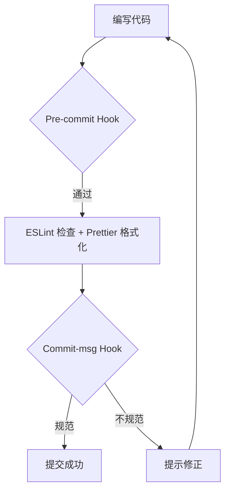

# wf-platform 产品需求文档 (PRD)

## 1. 产品概述

wf-platform 是一个基于 Vue3 + TypeScript 的企业级前端工作流平台，旨在提供标准化、工程化的项目基础设施，支持后续业务模块的快速迭代开发。

- **核心目标**：建立统一的前端工程规范，包含代码质量保障（ESLint/Prettier）、Git 提交规范（Husky/Commitlint）、目录结构标准化
- **目标价值**：降低团队协作成本，提升代码可维护性，确保项目长期可扩展性

## 2. 核心功能

### 2.1 技术架构模块

| 模块名称 | 技术选型 | 核心职责 |
|----------|----------|----------|
| 项目脚手架 | Vite + Vue3 + TypeScript | 提供快速开发构建能力 |
| 代码规范 | ESLint + Prettier | 统一代码风格与质量检查 |
| Git 规范 | Husky + Commitlint | 强制规范化提交信息 |
| 状态管理 | Pinia (Setup Store) | 集中管理应用状态 |
| 路由管理 | Vue Router | 页面路由与权限控制 |
| 接口层 | Axios + Mock | 数据请求与开发阶段 Mock |

### 2.2 目录结构规划

```
src/
├── api/              # API 接口定义层
├── assets/           # 静态资源（图片、字体等）
├── components/       # 公共组件
│   └── SchemaForm/   # 表单 schema 驱动组件
├── composables/      # 组合式函数（hooks）
├── directives/       # 自定义指令
├── layouts/          # 布局组件
├── mock/             # Mock 数据接口
├── router/           # 路由配置
├── stores/           # Pinia 状态管理
├── styles/           # 全局样式
├── utils/            # 工具函数库
└── views/            # 页面视图组件
```

### 2.3 配置文件清单

| 文件名 | 用途 | 关键配置项 |
|--------|------|------------|
| `.eslintrc.cjs` | ESLint 配置 | Vue3 + TS + Prettier 集成 |
| `.prettierrc.cjs` | Prettier 配置 | 双引号、分号、2空格、尾逗号all、80字符换行 |
| `commitlint.config.cjs` | Commitlint 配置 | Conventional Commits 规范 |

## 3. 核心流程

### 3.1 项目初始化流程


### 3.2 开发工作流



## 4. 编码规范设计

### 4.1 代码风格规范

- **框架语法**：Vue3 `<script setup lang="ts">` 组合式 API
- **TypeScript**：允许复杂场景使用 any（需注释），函数/对象必须 JSDoc
- **状态管理**：Pinia Setup Store 风格
- **命名规范**：
  - 组件文件：PascalCase（如 `TaskCard.vue`）
  - CSS 类名：`wf-` 前缀 + BEM（如 `wf-task-card__title--active`）
- **格式化**：双引号、分号、2空格缩进、尾逗号 all、80字符左右换行

### 4.2 Git 提交规范

采用 Conventional Commits 规范：

| 类型 | 说明 |
|------|------|
| feat | 新功能 |
| fix | Bug 修复 |
| docs | 文档更新 |
| style | 代码格式调整（不影响功能） |
| refactor | 重构（非新功能、非修复） |
| perf | 性能优化 |
| test | 测试相关 |
| chore | 构建/工具链变更 |

格式：`<type>(<scope>): <subject>`

示例：`feat(auth): 添加 JWT Token 自动刷新机制`

### 4.3 接口 Mock 规范

- 所有 Mock 函数添加 `@mock` 标记注释
- 预留替换为真实 Axios 请求的代码结构空间
- 返回类型与真实接口保持一致

## 5. 工程化约束

### 5.1 包管理器

强制使用 **npm** 作为包管理器，禁止使用 yarn 或 pnpm。

### 5.2 日志与降级要求

- 复杂逻辑必须添加 `console.warn/error` 日志
- 核心逻辑处预留降级方案注释
- 日志输出到控制台即可（无特别说明时）

### 5.3 时区考虑

涉及时间处理的逻辑需考虑北京时间（Asia/Shanghai）时区影响，在必要位置提醒用户确认。
