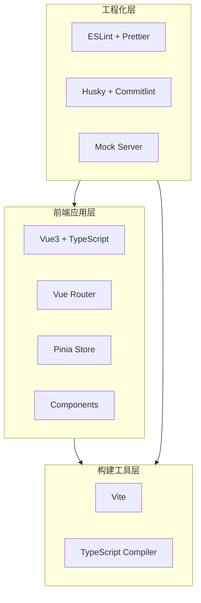

# wf-platform 技术架构文档

## 1. 架构设计



## 2. 技术选型说明

| 技术栈 | 版本 | 选型理由 |
|--------|------|----------|
| Vue3 | ^3.4+ | 组合式 API、更好的 TypeScript 支持、性能优化 |
| TypeScript | ^5.3+ | 类型安全、提升代码可维护性 |
| Vite | ^5.4+ | 极速 HMR、原生 ESM 支持、优化构建产物 |
| Pinia | ^2.1+ | 官方推荐状态管理、Setup Store 风格、TypeScript 友好 |
| Vue Router | ^4.3+ | 官方路由方案、支持路由守卫与懒加载 |
| ESLint | ^9.x | 代码质量检查、支持 Vue3 + TS 插件 |
| Prettier | ^3.2+ | 代码格式化工具、统一团队风格 |
| Husky | ^9.0+ | Git hooks 管理、自动化质量门禁 |
| Commitlint | ^19.x | 提交信息规范化、生成规范的 CHANGELOG |

### 2.1 初始化工具

使用 **Vite** 官方脚手架初始化项目：

```bash
npm create vite@latest wf-platform -- --template vue-ts
```

## 3. 目录结构定义

```
wf-platform/
├── .husky/                  # Git Hooks 配置目录
│   ├── pre-commit           # 提交前钩子（ESLint + Prettier）
│   └── commit-msg           # 提交信息钩子（Commitlint）
├── src/
│   ├── api/                 # API 接口层
│   │   ├── index.ts         # API 统一导出
│   │   ├── request.ts       # Axios 封装（预留）
│   │   └── modules/         # 按模块划分的接口文件
│   ├── assets/              # 静态资源
│   │   ├── images/          # 图片资源
│   │   └── fonts/           # 字体资源
│   ├── components/          # 公共组件
│   │   └── SchemaForm/      # Schema 驱动表单组件
│   ├── composables/         # 组合式函数
│   │   ├── useAuth.ts       # 认证相关逻辑
│   │   └── usePermission.ts # 权限控制逻辑
│   ├── directives/          # 自定义指令
│   │   └── permission.ts    # 权限指令
│   ├── layouts/             # 布局组件
│   │   ├── DefaultLayout.vue# 默认布局
│   │   └── AuthLayout.vue   # 认证页布局
│   ├── mock/                # Mock 数据
│   │   ├── index.ts         # Mock 入口
│   │   └── modules/         # 按模块划分的 Mock 数据
│   ├── router/              # 路由配置
│   │   ├── index.ts         # 路由实例
│   │   ├── routes.ts        # 路由表定义
│   │   └── guards.ts        # 路由守卫
│   ├── stores/              # Pinia 状态管理
│   │   ├── index.ts         # Store 统一导出
│   │   └── modules/         # 按模块划分的 Store
│   ├── styles/              # 全局样式
│   │   ├── variables.css    # CSS 变量（设计令牌）
│   │   ├── reset.css        # 样式重置
│   │   └── global.css       # 全局公共样式
│   ├── utils/               # 工具函数
│   │   ├── request.ts       # 请求封装工具
│   │   ├── storage.ts       # 本地存储封装
│   │   └── auth.ts          # 认证工具函数
│   ├── views/               # 页面视图
│   │   ├── home/            # 首页模块
│   │   └── login/           # 登录模块
│   ├── App.vue              # 根组件
│   ├── main.ts              # 应用入口
│   └── env.d.ts             # 环境变量类型声明
├── .eslintrc.cjs            # ESLint 配置
├── .prettierrc.cjs          # Prettier 配置
├── commitlint.config.cjs    # Commitlint 配置
├── package.json             # 项目依赖
├── tsconfig.json            # TypeScript 配置
├── tsconfig.app.json        # 应用 TS 配置
├── tsconfig.node.json       # Node.js TS 配置
└── vite.config.ts           # Vite 配置
```

## 4. 配置文件详细说明

### 4.1 ESLint 配置 (`.eslintrc.cjs`)

**核心规则集**：
- `eslint:recommended` - ESLint 基础规则
- `plugin:vue/vue3-recommended` - Vue3 最佳实践
- `@typescript-eslint/recommended` - TypeScript 规则
- `prettier` - 与 Prettier 协作（关闭冲突规则）

**关键配置项**：
- 解析器：`vue-eslint-parser`（处理 `.vue` 文件）
- TS 解析器：`@typescript-eslint/parser`
- 环境配置：browser + es2022 + node

### 4.2 Prettier 配置 (`.prettierrc.cjs`)

**严格遵循规范**：
```javascript
{
  "semi": true,              // 强制分号
  "singleQuote": false,      // 双引号
  "tabWidth": 2,             // 2 空格缩进
  "trailingComma": "all",    // 尾逗号 all
  "printWidth": 80,          // 80 字符换行
  "endOfLine": "lf",         // LF 换行符
  "vueIndentScriptAndStyle": false  // 不缩进 script/style 标签
}
```

### 4.3 Commitlint 配置 (`commitlint.config.cjs`)

**采用 Conventional Commits 规范**：
- 继承 `@commitlint/config-conventional`
- 支持类型：feat, fix, docs, style, refactor, perf, test, chore
- 支持作用域（scope）自定义

## 5. Git Hooks 工作流

### 5.1 Pre-commit Hook

触发时机：执行 `git commit` 后、提交信息写入前

执行任务：
1. 运行 `eslint` 检查暂存区文件
2. 运行 `prettier --write` 自动格式化
3. 检查失败则阻止提交

### 5.2 Commit-msg Hook

触发时机：提交信息写入后、正式提交前

执行任务：
1. 使用 `commitlint` 校验提交信息格式
2. 格式不符合 Conventional Commits 则阻止提交并提示修正

## 6. 依赖清单

### 6.1 开发依赖 (devDependencies)

| 包名 | 版本要求 | 用途 |
|------|----------|------|
| eslint | ^9.x | 代码质量检查 |
| @eslint/js | ^9.x | ESLint JS 规则 |
| eslint-plugin-vue | ^9.x | Vue3 ESLint 插件 |
| @typescript-eslint/parser | ^7.x | TS 解析器 |
| @typescript-eslint/eslint-plugin | ^7.x | TS ESLint 规则 |
| eslint-config-prettier | ^9.x | 关闭与 Prettier 冲突规则 |
| prettier | ^3.2+ | 代码格式化 |
| husky | ^9.0+ | Git Hooks 管理 |
| @commitlint/cli | ^19.x | Commitlint CLI |
| @commitlint/config-conventional | ^19.x | Conventional Commits 配置 |
| lint-staged | ^15.x | 暂存区文件检查 |

### 6.2 生产依赖 (dependencies)

| 包名 | 版本要求 | 用途 |
|------|----------|------|
| vue | ^3.4+ | 核心框架 |
| vue-router | ^4.3+ | 路由管理 |
| pinia | ^2.1+ | 状态管理 |
| axios | ^1.7+ | HTTP 请求库（预留） |

## 7. 时区说明

本项目涉及时间处理的场景需注意：
- **目标时区**：Asia/Shanghai（北京时间，UTC+8）
- **存储策略**：建议后端存储 UTC 时间，前端展示时转换为北京时间
- **日期库选择**：推荐使用 `dayjs` 或 `date-fns` 并配置时区插件

> ⚠️ 存疑：当前阶段仅进行工程化基建，暂不涉及具体业务逻辑的时间处理。后续开发时间相关功能时，需要确认后端接口返回的时间格式与时区策略。
